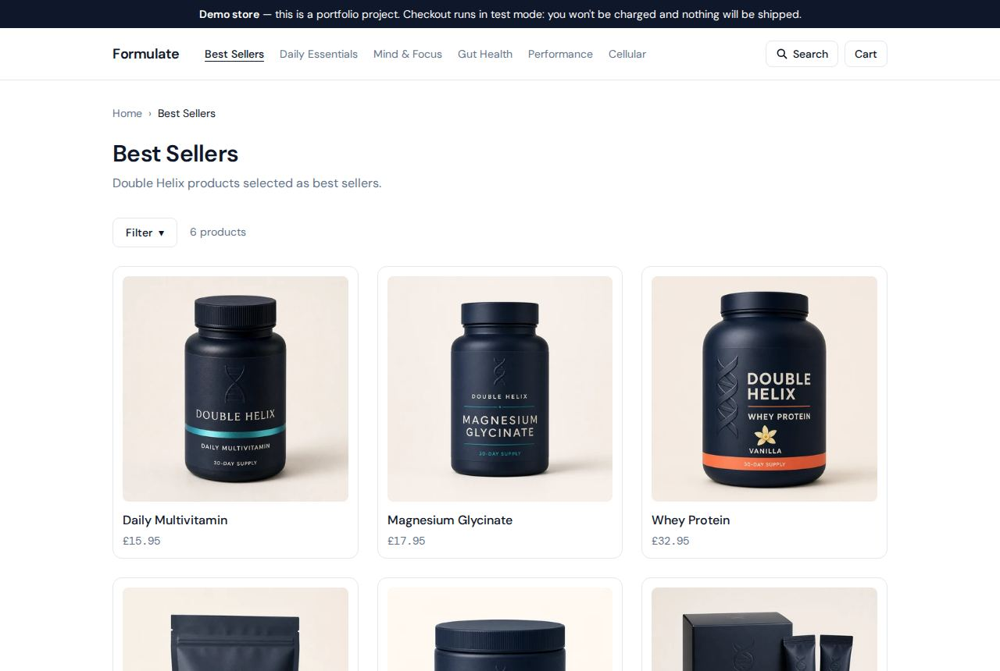
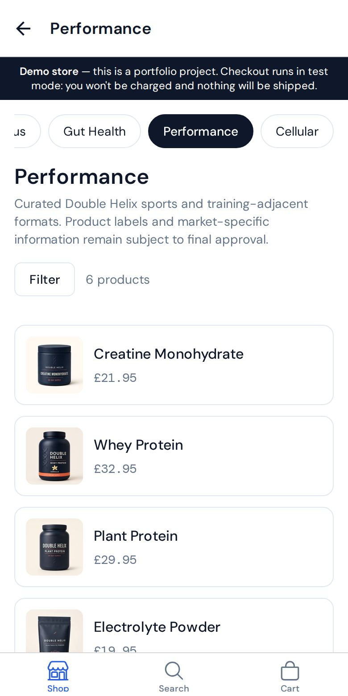
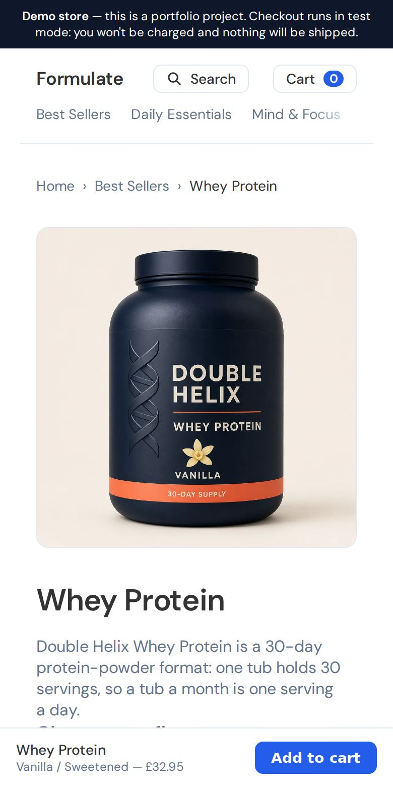
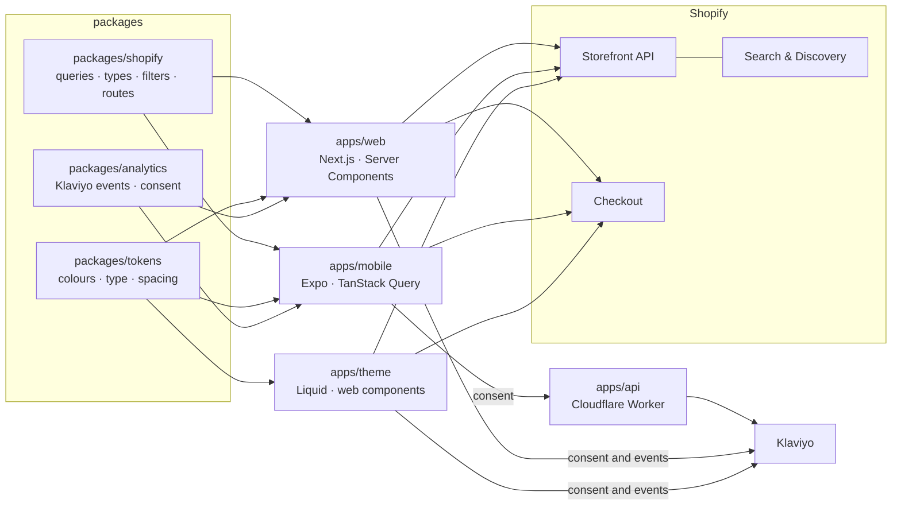

# Formulate

**One Shopify store, three storefronts.** A Next.js web app, an Expo React
Native app and a Liquid theme sell the same supplement subscriptions, built in
one Turborepo over a shared Storefront API layer and one set of design tokens.
It's a portfolio project on a real development store, with checkout in test
mode.

- **Web:** [web-six-murex-18.vercel.app](https://web-six-murex-18.vercel.app)
  (production deploys from `main`)
- **App:** no public build yet; EAS builds are SHO-24. It runs in Expo Go for
  development.
- **Theme:** the store is password-protected, as development stores are. The
  password is available on request.

| Web                                                                      | App                                                                                   | Theme                                                                      |
| ------------------------------------------------------------------------ | ------------------------------------------------------------------------------------- | -------------------------------------------------------------------------- |
|  |  |  |

## How it fits together



The two React apps share data code, through `packages/shopify`. All three
share design, through `packages/tokens`. The theme deliberately reads its data
from Liquid rather than the shared client
([ADR 0005](docs/adr/0005-parity-means-design-not-data.md)).

## The stack, and why

| Choice                                     | Why                                                                                                                                                                              |
| ------------------------------------------ | -------------------------------------------------------------------------------------------------------------------------------------------------------------------------------- |
| **Turborepo + pnpm, theme included**       | One change can land on all three surfaces in one PR, and the theme is versioned with the code it mirrors ([ADR 0001](docs/adr/0001-monorepo-over-separate-theme-repository.md)). |
| **Next.js 16, App Router**                 | Every Storefront query runs in a Server Component, so the web app's token never reaches a browser.                                                                               |
| **Expo SDK 57 + Expo Router**              | File routes match web's URLs, which a shared route contract and a parity test enforce.                                                                                           |
| **Liquid theme, no build step**            | Shopify's own storefront, as a reference and for the store's native features. Plain ES modules, typed with JSDoc.                                                                |
| **Tailwind v4 + NativeWind v5**            | Web and the app consume the same generated token CSS. NativeWind v5 is a preview, a known risk ([ADR 0003](docs/adr/0003-nativewind-v5-and-tailwind-v4.md)).                     |
| **GraphQL codegen from a bundled schema**  | Typed queries, generated offline with no store credentials.                                                                                                                      |
| **A Cloudflare Worker for mobile consent** | Klaviyo's client endpoints are blocked from native apps, and a private key can't ship in an app ([ADR 0007](docs/adr/0007-mobile-consent-goes-through-a-worker.md)).             |
| **Search & Discovery**                     | Filters and "Pairs well with" are configured by the merchant, not in code, and are the same on all three surfaces.                                                               |

## Worth a closer look

- **Design tokens on three runtimes.** One TypeScript source generates the CSS
  for Tailwind on web, NativeWind in the app and plain CSS in the theme, and
  every surface uses DM Sans and DM Mono from it.
- **Measured, not assumed, performance.** Lighthouse CI runs on every web
  deployment and on the theme. A lab "2.5 s render delay" turned out to be an
  artefact of simulated throttling: real throttling put LCP render delay near
  0.1 s, and the fix was image loading ([surface-web.md](docs/surface-web.md)).
- **Accessibility in CI on every surface.** axe (WCAG 2.2 AA) runs against web
  deployments and against a temporary copy of the theme pushed for each PR.
  Keyboard paths are tested end to end.
- **Consent done properly.** Web gates Klaviyo on consent; the app records
  consent through the Worker; a restock alert is not a marketing sign-up and
  says so ([integration-klaviyo.md](docs/integration-klaviyo.md)).
- **Headless subscriptions** with Recharge are in progress
  ([integration-recharge.md](docs/integration-recharge.md)).

## Structure

```
apps/
  web/          Next.js 16 · App Router · Tailwind v4 · deploys to Vercel
  mobile/       Expo SDK 57 · Expo Router · NativeWind v5 · builds via EAS
  theme/        Liquid · web components · no build step · Shopify Online Store
  api/          Cloudflare Worker · records mobile marketing consent in Klaviyo
packages/
  shopify/      Storefront API client, query documents, generated types, routes
  tokens/       Design tokens (TS source) → generated CSS for Tailwind and Liquid
  analytics/    Klaviyo event payloads and consent requests, shared by web and app
  eslint-config/
  typescript-config/
docs/           Architecture, domain model, decision records (also an Obsidian vault)
```

## Documentation

- [`docs/`](docs/README.md) — architecture, domain model, integration design
- [`docs/adr/`](docs/adr/README.md) — architecture decision records
- [`AGENTS.md`](AGENTS.md) — conventions and constraints, for humans and agents alike

## The one architectural rule

**`packages/shopify` must stay platform-neutral.** Both React apps import it, so
it uses bare `fetch` and has no Shopify runtime dependency — nothing
DOM-flavoured. Web-only ergonomics (`@shopify/hydrogen-react`'s `<Image>`) live
in `apps/web`.

`@shopify/hydrogen-react` _is_ a devDependency of `packages/shopify`, but only
for codegen: it ships the Storefront GraphQL schema as a local JSON file, so
type generation runs offline with no credentials and no network call.

The Liquid theme is the exception: it reads its data from Liquid, server-side,
and deliberately does not use `packages/shopify` at all. What all three share is
the design tokens — see
[ADR 0005](docs/adr/0005-parity-means-design-not-data.md).

## Data fetching differs by platform, deliberately

|               | Web                       | Native                  | Liquid theme        |
| ------------- | ------------------------- | ----------------------- | ------------------- |
| Fetching      | React Server Components   | TanStack Query          | Liquid, server-side |
| Token env var | `SHOPIFY_*` (server-only) | `EXPO_PUBLIC_SHOPIFY_*` | none needed         |

The web app never sends its token to the browser because every query runs on the
server. The Expo bundle _is_ the client, so its token ships with the app — which
is exactly what a public Storefront access token is designed for.

⚠️ The Admin API token must never appear in any package. Anything Admin-flavoured
belongs behind a Next.js route handler.

## Setup

```bash
pnpm install
```

Create a Storefront access token (Shopify admin → add the **Headless** sales
channel → create a storefront → publish products to it), then:

```bash
cp apps/web/.env.example apps/web/.env.local
cp apps/mobile/.env.example apps/mobile/.env.local
```

Fill in `SHOPIFY_STORE_DOMAIN` and `SHOPIFY_STOREFRONT_TOKEN` in the first, and
the same values under their `EXPO_PUBLIC_` names in the second. Each example
file says what every variable is for. Both copies are gitignored; this
repository is public. The theme and the API worker have their own examples
(`apps/theme/.env.local.example`, `apps/api/.dev.vars.example`).

Confirm the credential works before starting either app:

```bash
pnpm --filter @formulate/shopify smoke
```

## Commands

```bash
pnpm web          # Next.js dev server on :3000
pnpm mobile       # Expo dev server
pnpm lint         # ESLint across the workspace
pnpm typecheck    # tsc --noEmit across the workspace
pnpm build        # Next build + Expo export
pnpm codegen      # Regenerate Storefront types from the query documents
```

After editing `packages/shopify/src/queries.ts`, run `pnpm codegen` and commit
the result — CI fails if the generated output has drifted.

After editing `packages/tokens/src/tokens.ts`, run
`pnpm --filter @formulate/tokens build` to regenerate `theme.css`. Never edit
that file by hand.

## Known version constraints

These are load-bearing. Read the comments before changing them.

- **`lightningcss` is pinned to `1.30.1`** in `pnpm-workspace.yaml`. NativeWind v5
  deserialises lightningcss output in `react-native-css`, and any newer version
  fails at Metro bundle time — never at install time.
- **TypeScript is pinned to `~6.0.3`, not 7.** No `typescript-eslint` release
  supports TypeScript 7 (all cap at `<6.1.0`), and its parser is what lets
  ESLint read TypeScript at all. 6.0.3 is the sweet spot: inside that range and
  exactly what Expo SDK 57 expects. Note TS 6 deprecates `baseUrl`, so the app
  tsconfigs use `paths` alone.
- **React is pinned to `19.2.3` workspace-wide** via a pnpm override, because
  that is the version Expo SDK 57 expects. Under the hoisted node linker a
  second React copy would break hooks in the Expo app.
- **React version is declared explicitly** in `packages/eslint-config/react-native.js`.
  `eslint-plugin-react` 7.37.x crashes on ESLint 10 during version _detection_.
- **NativeWind v5 is pre-release** (`5.0.0-preview.4`), chosen so both apps share
  one Tailwind v4 token file. The fallback is NativeWind v4 + Tailwind v3 in
  `apps/mobile` only.
